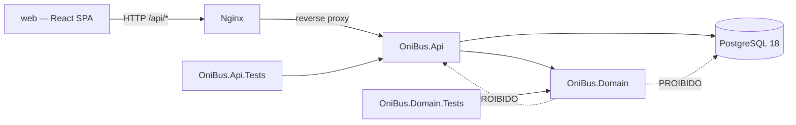
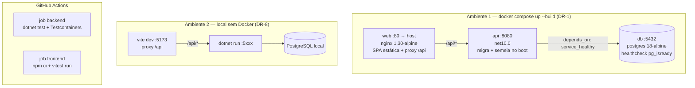
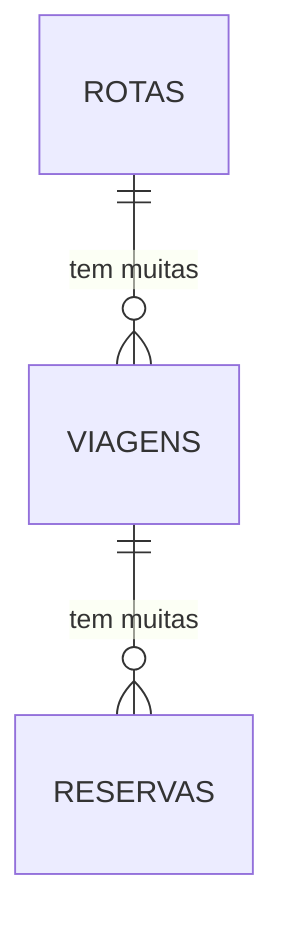

# Architecture Spine — OniBus Express

## Design Paradigma

**Fatias verticais sobre um núcleo de domínio puro.** Três projetos de produção-e-teste, não quatro camadas:

| Projeto | Papel | Pode depender de |
| --- | --- | --- |
| `OniBus.Domain` | Entidades, objetos de valor, as cinco regras de negócio, portas (`IRelogio`, `IGeradorCodigoReserva`) | Nada além da BCL |
| `OniBus.Api` | Uma fatia por capacidade (endpoint + orquestração + DTOs), `DbContext`, mapeamentos EF, migrações, seed, adaptadores das portas | `OniBus.Domain` |
| `web` | Uma fatia por capacidade em `src/features`, sobre `src/shared` | — |

Cada fatia é vertical: `POST /reservas` vive num arquivo com seu endpoint, seu DTO e sua orquestração, e chama o domínio para decidir. Não existe projeto `Infrastructure` e não existe camada `Application`.



## Invariants & Rules

### AD-1 — `OniBus.Domain` não referencia infraestrutura

- **Binds:** todo o backend
- **Prevents:** a alegação "as regras estão isoladas" ficar sendo promessa em vez de propriedade verificável — e o domínio adquirir `using Microsoft.EntityFrameworkCore` por conveniência num único método
- **Rule:** `OniBus.Domain.csproj` não tem nenhum `PackageReference` nem `ProjectReference`. Qualquer adição a esse arquivo é violação de arquitetura, não detalhe de implementação. É o csproj que impõe a fronteira, não a disciplina.

### AD-2 — Portas declaradas no domínio, implementadas na Api

- **Binds:** FR-8, FR-10, FR-13, FR-14
- **Prevents:** o domínio depender da Api (invertendo AD-1) ou duplicar o contrato; e o extremo oposto — criar porta para cada dependência
- **Rule:** existem exatamente duas portas, `IRelogio` e `IGeradorCodigoReserva`, ambas declaradas em `OniBus.Domain` e implementadas em `OniBus.Api`. Nenhuma outra abstração de infraestrutura é introduzida. Nada no código chama `DateTimeOffset.UtcNow`, `DateTime.Now` ou `Random` fora do adaptador correspondente.

### AD-3 — Instante em UTC; dia de calendário no fuso de negócio

- **Binds:** FR-2, FR-10, FR-13, FR-14
- **Prevents:** duas divergências distintas e ambas silenciosas — comparar hora local contra timestamp UTC (erro de 3 h que faz o teste de fronteira de FR-13 passar ou falhar por acidente), e tratar o dia de calendário de FR-2 como dia UTC, fazendo a Viagem das 22 h de sábado aparecer na busca de domingo
- **Rule:** instantes são `DateTimeOffset` em UTC, coluna `timestamptz`; `IRelogio.Agora` devolve UTC. O dia de calendário tem um único fuso de negócio, `America/Sao_Paulo`, usado **só** para traduzir a data de FR-2 num intervalo meio-aberto `[inícioUtc, fimUtc)` calculado em C# antes da consulta. Nenhuma conversão de fuso dentro de LINQ traduzido; nenhum `partida.Date == data`. `DataNascimento` é `DateOnly` (coluna `date`), não instante.

### AD-4 — Não existe tabela de Assentos

- **Binds:** FR-3, FR-4, FR-5, FR-9, FR-12
- **Prevents:** materializar 44 linhas por Viagem e manter nelas um flag de ocupação — segunda fonte de verdade sobre a mesma informação, que o Glossário do PRD já proibiu ao tornar "assentos disponíveis" valor derivado
- **Rule:** três tabelas: `rotas`, `viagens`, `reservas`. Os 44 Assentos vêm de uma constante de Layout do Ônibus em `OniBus.Domain`; Livre/Ocupado é derivado das Reservas `Confirmada` da Viagem, sempre. Nenhuma coluna de contagem, nenhum flag de ocupação, em nenhuma tabela.
- **Dono único da derivação:** `LayoutOnibus.EstadoDosAssentos(reservasConfirmadas)` em `OniBus.Domain` é a **única** implementação. Suas três consumidoras — a contagem de Livres de FR-2, o estado por Assento de FR-3/FR-4, e o flag de Esgotada de FR-2 — chamam essa função; nenhuma fatia da Api deriva ocupação por conta própria. Sem isso, três fatias escrevem três consultas e a que esquecer de filtrar `Status = 'Confirmada'` passa a mostrar como Ocupado um Assento liberado por cancelamento. A validação de `numero_assento` (1..44) também pergunta ao Layout; a Api não repete o literal.

### AD-5 — Passageiro é valor inline em `reservas`, não entidade

- **Binds:** FR-7, FR-11
- **Prevents:** criar tabela `passageiros` com CPF único — o PRD é explícito de que o CPF identifica a pessoa mas **não** é chave de Reserva, e a mesma pessoa pode ter várias Reservas, inclusive na mesma Viagem
- **Rule:** `Passageiro` é um `record` mapeado com `ComplexProperty` do EF Core 10, gravado inline em `reservas` como `passageiro_nome`, `passageiro_cpf`, `passageiro_email`, `passageiro_data_nascimento`. Sem contas e sem histórico, os dados do Passageiro são snapshot do momento da compra. Não há `DbSet<Passageiro>`.

### AD-6 — A unicidade de (Viagem, Assento) é do banco, por índice único parcial

- **Binds:** FR-9, FR-12
- **Prevents:** verificar disponibilidade em memória e depois inserir — implementação que passa em teste sequencial e vende o mesmo assento duas vezes sob concorrência
- **Rule:** índice `ux_reservas_viagem_assento_confirmada` único sobre `(viagem_id, numero_assento)` com filtro `WHERE status = 'Confirmada'`. O predicado é o que satisfaz FR-9 e FR-12 ao mesmo tempo: a linha Cancelada fica fora do índice, logo o Assento volta a ser reservável sem nenhum código adicional. `StatusReserva` é persistido como **string** (`HasConversion<string>()`) para que o filtro cite `'Confirmada'` literalmente e não sobreviva à reordenação do enum. Nenhuma verificação em memória substitui o índice.

### AD-7 — Violação de unicidade é discriminada por nome de constraint

- **Binds:** FR-8, FR-9
- **Prevents:** o ponto exato em que uma implementação plausível quebra — o PostgreSQL levanta `SqlState 23505` para os **dois** índices únicos, e eles exigem tratamento oposto: colisão de código pede retry silencioso, colisão de assento pede `409 ASSENTO_OCUPADO` ao usuário. Capturar 23505 genérico transforma um dos dois num erro errado
- **Rule:** o tradutor de exceção lê `PostgresException.ConstraintName` e mapeia por nome. Nomes fixados e citáveis: `ux_reservas_codigo` → retry da geração; `ux_reservas_viagem_assento_confirmada` → `409 ASSENTO_OCUPADO`. Nenhuma violação de unicidade escapa como `500`.
- **Mecânica do retry:** o retry muta o Código da **mesma entidade já rastreada** e re-chama `SaveChangesAsync`. Nada mais do handler re-executa. Criar uma nova entidade depois do `DbUpdateException` insere **duas** Reservas, porque a primeira continua rastreada como `Added` — é o modo de falha exato que uma implementação plausível produz aqui.

### AD-8 — Código de Reserva: gerador injetável, imprevisível, forma canônica

- **Binds:** FR-8, FR-11
- **Prevents:** unicidade "garantida por sorteio" (com 1,76 bilhão de combinações, um teste que gera N códigos e confere passa por acaso); códigos enumeráveis; e duas grafias do mesmo código tratadas como códigos distintos
- **Rule:** `IGeradorCodigoReserva` é injetável, para que o teste force a colisão em vez de esperá-la. A implementação de produção usa `RandomNumberGenerator` — nunca `Random`, nunca sequencial, nunca derivado do id. Colisão é retentada até 5 vezes; esgotadas, falha explícita, nunca Reserva sem código. O código é armazenado em forma canônica `AAA-00000`, e a normalização de entrada (caixa e hífen, exigida por FR-11) acontece na borda, antes da consulta — não em `WHERE UPPER(codigo) = …`, que descartaria o índice. **A normalização tem um dono único:** `CodigoReserva.Parse` em `OniBus.Domain`, usado tanto por `GET /reservas/{codigo}` quanto por `DELETE /reservas/{codigo}`. Dois normalizadores por endpoint divergem na primeira grafia que só um deles tolera.

### AD-9 — Toda recusa é `ProblemDetails` com código de vocabulário fechado

- **Binds:** FR-2, FR-6, FR-7, FR-9, FR-10, FR-11, FR-12, FR-13
- **Prevents:** o frontend fazer *string matching* em mensagem de erro porque cada endpoint inventou seu próprio formato — e FR-9 depende de distinguir `ASSENTO_OCUPADO` dos outros `409` para recarregar o Mapa preservando o formulário
- **Rule:** RFC 9457 `ProblemDetails` em toda resposta de erro, com membro de extensão `codigo`. O vocabulário é fechado: `CPF_INVALIDO`, `CAMPO_INVALIDO`, `ASSENTO_OCUPADO`, `VIAGEM_REALIZADA`, `JANELA_CANCELAMENTO_FECHADA`, `RESERVA_NAO_ENCONTRADA`, `VIAGEM_NAO_ENCONTRADA`. Nenhum endpoint devolve forma própria. `204` do cancelamento não tem corpo; `409` e `404` sempre têm.

### AD-10 — Duas camadas de teste, e nenhum SQLite

- **Binds:** FR-6, FR-8, FR-9, FR-10, FR-13, DR-1
- **Prevents:** o pior resultado possível da entrega — suíte verde e FR-9 sem garantia real. O SQLite in-memory não reproduz nem a concorrência nem o índice único parcial, logo o teste de maior peso não roda nele; mantê-lo para os demais criaria uma segunda história de persistência que passa verde enquanto o PostgreSQL falha
- **Rule:** `OniBus.Domain.Tests` — xUnit puro, sem banco e sem host (FR-6, FR-8 formato, FR-10, FR-13 nas três fronteiras 2 h 01 / 2 h 00 / 1 h 59). `OniBus.Api.Tests` — `WebApplicationFactory` + Testcontainers com PostgreSQL real, imagem pinada em `postgres:18-alpine`, idêntica à do compose (FR-9 concorrente, colisão forçada de código, contrato HTTP). Um teste que precisa de banco vive na segunda camada; um que não precisa **não pode** viver nela. SQLite não é usado em nenhuma delas.
- **No frontend, o mock tem uma costura só:** os três testes exigidos (busca, Mapa de Assentos, validação do formulário) mockam o **cliente tipado de `src/shared/api`**, nunca o `fetch` global e sem MSW. Prevents: três testes mockando em três alturas diferentes, cada um acoplado a um detalhe distinto — e uma dependência a mais para justificar em DR-2 sem nenhum FR a exercer. Os testes exercem comportamento do usuário (preencher, clicar, ver), não implementação.

### AD-11 — O frontend nunca conhece URL absoluta da API

- **Binds:** DR-1, DR-8
- **Prevents:** a armadilha clássica do Vite — `VITE_API_URL` é assado no bundle em tempo de *build*, amarrando a imagem a um host e quebrando DR-1 na máquina de outra pessoa. Prevê também a divergência entre os dois ambientes obrigatórios, que teriam código diferente
- **Rule:** todo `fetch` usa caminho relativo `/api/*`. No Docker, Nginx faz reverse proxy de `/api` para o serviço `api`; sem Docker, o proxy de dev do Vite faz o mesmo. O código do frontend é idêntico nos dois caminhos, e **não existe configuração de CORS na Api** — nunca há segunda origem. Nenhuma variável de ambiente de URL de API, em nenhum dos dois caminhos.

### AD-12 — Quatro estados de tela; vazio é sub-estado de sucesso

- **Binds:** FR-2, FR-3, FR-4, FR-11
- **Prevents:** exatamente a confusão que o PRD antecipou — tratar "API fora do ar" com a mesma mensagem de "nenhuma Viagem encontrada", dizendo ao Passageiro que não existe viagem quando o servidor está caído
- **Rule:** toda tela que chama a API distingue quatro estados: `carregando`, `sucesso` (com resultados **ou** vazio), `erro de entrada` (`400`), `falha de comunicação` (rede ou `5xx`). Vazio nunca é renderizado como erro. Os `409` têm tratamento próprio por `codigo`, não pelo estado genérico. Um único cliente HTTP tipado em `src/shared/api` concentra `fetch`, normalização de `ProblemDetails` e o discriminador de código; o vocabulário de AD-9 não vaza para dentro de componentes.

### AD-13 — A store carrega rascunho de intenção; a URL carrega identidade de recurso

- **Binds:** FR-2, FR-4, FR-5, FR-7, FR-9
- **Prevents:** F5 no Mapa de Assentos zerar o fluxo; e o Passageiro perder o que digitou quando FR-9 recusa a Reserva e o mapa recarrega — o caso de borda de UJ-1
- **Rule:** uma única store Zustand de fluxo de compra guarda Viagem selecionada, Assento selecionado e **rascunho do formulário do Passageiro**. `viagemId` viaja na rota (`/viagens/:viagemId/assentos`), não só na store. O rascunho na store é o que torna a preservação de contexto de FR-9 propriedade da arquitetura em vez de trabalho manual a cada remontagem.

### AD-14 — Validação idêntica nos dois lados, com fronteiras fixadas

- **Binds:** FR-6, FR-7
- **Prevents:** o pior erro de formulário — cliente aceita e servidor recusa; e o teste de frontend exigido ("validação do formulário de passageiro") não ter fronteira definida para asserir além do CPF
- **Rule:** as mesmas regras e as mesmas fronteiras no cliente e no servidor, cada um validando de forma independente. CPF: 11 dígitos, dois dígitos verificadores conferidos, **sequências repetidas rejeitadas explicitamente**, máscara opcional. Nome: 3..120 caracteres após `trim`. E-mail: formato verificado, máximo 254 caracteres. `DataNascimento`: no passado, idade entre 0 e 120 anos.

### AD-15 — Migração e seed no boot, um só caminho de código

- **Binds:** DR-1, DR-8, FR-14
- **Prevents:** DR-1 e DR-8 divergirem — quem seguir o caminho sem Docker encontrar a busca vazia; e a falha intermitente mais comum de DR-1, a Api subir antes do Postgres aceitar conexão
- **Rule:** `Database.MigrateAsync()` seguido de seed idempotente, no boot da Api, no mesmo caminho de código para os dois ambientes. `depends_on` com `condition: service_healthy` sobre o healthcheck `pg_isready` do `db` — `depends_on` sozinho garante ordem de início, não prontidão. A idempotência do seed é por chave natural (Rota por `(origem, destino)`, Viagem por `(rota, partida)`), nunca por `if (!db.Rotas.Any())`. Datas semeadas são **sempre** relativas a `IRelogio.Agora`; nenhum literal de calendário em código de seed.
- **Volume do catálogo (FR-14):** 5 Rotas e 16 Viagens, dimensionado pelo que precisa ser *demonstrável*, não por volume. A Rota principal recebe várias Viagens em 3 dias distintos para que a busca tenha resultado plausível; as demais recebem 2 a 3, para que a busca sem correspondência — o estado vazio de FR-2 — também seja alcançável. O conjunto inclui obrigatoriamente uma Viagem Esgotada, uma Realizada, uma parcialmente ocupada, uma dentro da Janela de Cancelamento e uma fora dela.
- **O seed obedece aos mesmos invariantes que a API:** as Reservas que ele cria (as 44 da Viagem Esgotada, as parciais, as usadas para demonstrar FR-13) passam por `IGeradorCodigoReserva` e pela regra de CPF, não por códigos e CPFs escritos à mão. Um código inventado como `SEED-00001` não casa com `AAA-00000` e envenena FR-11 justamente na Reserva que o avaliador vai consultar primeiro.

### AD-16 — Dado pessoal nunca entra em log

- **Binds:** FR-7, FR-11, DR-7
- **Prevents:** logar o payload de `POST /reservas` inteiro para depurar e versionar CPF em repositório público
- **Rule:** log estruturado em stdout via `ILogger` nativo. Nome, CPF, e-mail e data de nascimento não aparecem em log nem em mensagem de exceção. O Código de Reserva pode ser logado. Credenciais do compose são valores locais óbvios e descartáveis, com `.env.example` versionado; nenhuma string de conexão real ou segredo no repositório.

### AD-17 — A Janela de Cancelamento guarda a transição, não o estado

- **Binds:** FR-12, FR-13
- **Prevents:** duas ordens de verificação possíveis no mesmo endpoint, produzindo `204` num builder e `409` no outro para a mesma entrada — Reserva **já Cancelada** cuja Viagem parte em menos de 2 h
- **Rule:** `DELETE /reservas/{codigo}` verifica na ordem: (1) Reserva existe? senão `404`; (2) Status já é `Cancelada`? então `204`, sem consultar a Janela; (3) só então a Janela de Cancelamento, que recusa com `409 JANELA_CANCELAMENTO_FECHADA`. A Janela guarda a *transição* de Confirmada para Cancelada; sem transição a fazer, não há o que impedir. A idempotência de FR-12 tem precedência sobre FR-13, nunca o contrário.

## Consistency Conventions

| Concern | Convention |
| --- | --- |
| Nomes de domínio | O Glossário do PRD é literal e obrigatório no código: `Rota`, `Viagem`, `Assento`, `Reserva`, `Passageiro`, `StatusReserva`. *Passagem* é proibido como sinônimo. Domínio e regras em **português**; palavras-chave de framework e nomes de pacote em inglês. |
| Fatias | A mesma capacidade tem o mesmo nome nos dois lados: `Api/Features/{Rotas,Viagens,Reservas}` e `web/src/features/{busca,assentos,reserva,consulta}`. Um arquivo por endpoint. |
| Banco | `snake_case` em tabelas e colunas; plural em tabelas. Chave primária `uuid` gerada na aplicação. Índices únicos prefixados `ux_`. |
| Datas e formatos | Instante: ISO-8601 com offset, sempre UTC no fio. Data de calendário: `YYYY-MM-DD`, sem hora e sem offset. Código de Reserva: `AAA-00000` canônico. Dinheiro: `decimal(10,2)`, `numeric` no Postgres — nunca `float`. |
| Apresentação | Uma única função de formatação por tipo, em `src/shared`, usada por todas as fatias: preço via `Intl.NumberFormat('pt-BR', BRL)`, data e hora via `Intl.DateTimeFormat` no fuso do navegador. Nenhuma tela formata por conta própria. O frontend não faz aritmética de fuso nem de dinheiro. |
| Idioma | Toda a interface e todas as mensagens de erro visíveis são pt-BR. Não há i18n e não há chave de tradução — o `title` do `ProblemDetails` é texto pt-BR pronto para exibição, e o `codigo` é o que a máquina lê. |
| Erros | `ProblemDetails` (AD-9) em toda resposta de erro, com `codigo` do vocabulário fechado. `400` entrada inválida, `404` inexistente, `409` recusa por regra de negócio. |
| Frontend | Importar de `react-router`, **nunca** de `react-router-dom` — o pacote não existe na v8, e todo material anterior a jun/2026 começa por ele. Componentes `.tsx` em `PascalCase`; hooks `use*`. Estados de Assento distinguíveis sem depender só de cor (forma, borda ou rótulo). |
| Testes | Nome do teste descreve a regra e sua fronteira, não o método (`Cancelamento_a_exatamente_2h_da_partida_e_recusado`). Cada um dos cinco testes de regra deve **falhar** se a regra for removida. |
| Config | Variáveis de ambiente para conexão e porta; nada de `appsettings` com segredo. Nenhuma variável de URL de API (AD-11). |

## Stack

Versões verificadas na web em 2026-08-18. **`.NET 8` e `.NET 9` chegam ao fim do suporte em 10/11/2026**; a spec pede ".NET 8+" e `net10.0` satisfaz o "+" sobre o LTS atual, suportado até nov/2028.

| Name | Version |
| --- | --- |
| .NET / ASP.NET Core (`net10.0`, minimal APIs) | 10 (LTS) |
| Entity Framework Core | 10.0.x |
| Npgsql.EntityFrameworkCore.PostgreSQL | 10.0.3 |
| PostgreSQL (`postgres:18-alpine`) | 18 |
| Microsoft.AspNetCore.OpenApi + Scalar.AspNetCore | 10.x / atual |
| xunit.v3 | 3.1.0 |
| Testcontainers + Testcontainers.PostgreSql | 4.12.0 |
| Node.js (build do frontend, `node:24-alpine`) | 24 (LTS) |
| React + React DOM | 19.2.x |
| TypeScript | 5.x |
| Vite | 8.2.x |
| react-router (modo declarativo, ESM-only) | 8.3.x |
| Zustand | 5.0.x |
| Vitest + @testing-library/react + @testing-library/dom | 4.1.x / 16.3.x / atual |
| Nginx (`nginx:1.30-alpine`) | 1.30 (stable) |

`xunit.v3 4.0.0` (15/08/2026) e `Vitest 5` (beta) foram descartados deliberadamente: numa janela de uma semana, uma versão de três dias que troca o runner padrão é risco sem retorno, e nenhum critério de avaliação lê o número da versão. `Testcontainers.XunitV3` também ficou fora — uma *class fixture* com `IAsyncLifetime` escrita à mão custa ~15 linhas e elimina o acoplamento mais apertado da stack (versão do xUnit ↔ versão do Testcontainers).

## Structural Seed

### Containers e ambientes

Existem exatamente dois ambientes, mais o runner de CI. Não há ambiente hospedado, provedor de nuvem, staging nem pipeline de deploy — o produto vai a avaliação em repositório, não a mercado.



### Entidades

Três tabelas. Assentos e disponibilidade são derivados (AD-4); Passageiro é valor inline (AD-5).



`reservas` carrega `numero_assento` (1..44) e os quatro campos do Passageiro inline. Não há tabela de Assentos nem de Passageiros, e nenhuma coluna de contagem: o Layout do Ônibus é constante do domínio e a disponibilidade é derivada (AD-4, AD-5).

### Árvore de origem

```text
ticket-busao/
  docker-compose.yml
  .env.example
  README.md
  .github/workflows/ci.yml
  backend/
    OniBus.sln
    OniBus.Domain/            # puro — csproj sem nenhuma referência (AD-1)
      Reservas/               # Reserva, Passageiro, StatusReserva, CodigoReserva
      Viagens/                # Rota, Viagem, LayoutOnibus (44 assentos)
      Regras/                 # CPF, JanelaCancelamento, ViagemRealizada
      Portas/                 # IRelogio, IGeradorCodigoReserva
    OniBus.Api/
      Features/               # uma fatia por endpoint: Rotas/, Viagens/, Reservas/
      Persistence/            # DbContext, mapeamentos, Migrations/, Seed/
      Adapters/               # RelogioSistema, GeradorCodigoCriptografico
      Errors/                 # ProblemDetails + tradutor de 23505 por constraint
      Dockerfile
    OniBus.Domain.Tests/      # xUnit puro, sem banco
    OniBus.Api.Tests/         # WebApplicationFactory + Testcontainers
  web/
    src/
      features/               # busca/, assentos/, reserva/, consulta/
      shared/                 # api/ (cliente tipado), store/ (Zustand), ui/
    nginx.conf                # serve a SPA + proxy /api → api:8080
    Dockerfile
```

## Capability → Architecture Map

| Capacidade / Área | Vive em | Governado por |
| --- | --- | --- |
| FR-1 Listar Rotas | `Api/Features/Rotas` · `web/features/busca` | paradigma |
| FR-2 Buscar Viagens | `Api/Features/Viagens` · `web/features/busca` | AD-3, AD-4, AD-9, AD-12 |
| FR-3 Detalhar Viagem com Assentos | `Api/Features/Viagens` | AD-4 |
| FR-4 Mapa de Assentos · FR-5 Selecionar | `web/features/assentos` | AD-12, AD-13, convenção de frontend |
| FR-6 Validar CPF | `Domain/Regras` + `web/features/reserva` | AD-1, AD-10, AD-14 |
| FR-7 Criar Reserva | `Api/Features/Reservas` · `web/features/reserva` | AD-5, AD-9, AD-13, AD-14 |
| FR-8 Código de Reserva | `Domain/Portas` + `Api/Adapters` | AD-2, AD-7, AD-8, AD-10 |
| FR-9 Assento Ocupado (concorrência) | `Api/Persistence` + `Api/Errors` | **AD-6, AD-7**, AD-9, AD-10, AD-13 |
| FR-10 Viagem Realizada | `Domain/Regras` | AD-2, AD-3, AD-10 |
| FR-11 Consultar Reserva | `Api/Features/Reservas` · `web/features/consulta` | AD-8, AD-9, AD-12 |
| FR-12 Cancelar · FR-13 Janela de Cancelamento | `Domain/Regras` + `Api/Features/Reservas` | AD-2, AD-3, AD-6, AD-9, AD-10, **AD-17** |
| FR-14 Catálogo semeado | `Api/Persistence/Seed` | AD-15 |
| DR-1 Um comando · DR-8 sem Docker | `docker-compose.yml`, `Dockerfile`s, `nginx.conf` | AD-11, AD-15 |
| DR-3 Swagger navegável | `Api` (OpenAPI + Scalar, com redirect de `/swagger`) | AD-9 |
| DR-2, DR-4, DR-5, DR-6, DR-7 | `README.md`, histórico de git, repositório | — (processo, não código) |
| CI (Faixa 3) | `.github/workflows/ci.yml` | AD-10 |
| Privacidade e repositório público | transversal | AD-16 |

## Deferred

- **Layout do Ônibus configurável por Viagem** — AD-4 fixa 44 assentos como constante do domínio. O dia em que houver frota heterogênea, `LayoutOnibus` vira entidade e a constante vira `viagens.layout_id`. Nada mais de AD-4 muda. Nomear em DR-6.
- **Múltiplos Assentos ou Passageiros por Reserva** — AD-5 e AD-6 assumem um Assento por Reserva. É o item deferido mais defensável: `ux_reservas_viagem_assento_confirmada` continua correto, o que muda é a agregação acima dele. Nomear em DR-6.
- **Autenticação, contas e autorização** — Non-Goal do PRD. O Código de Reserva é a única credencial (AD-8). Nenhum AD reserva espaço para identidade.
- **Deploy hospedado, observabilidade, staging** — declarados fora do envelope operacional, não esquecidos. Log em stdout (AD-16) é o teto; não há métrica, trace nem alerta.
- **Cache e paginação** — nenhum FR os pede, o catálogo semeado tem 16 Viagens e AD-12 assume resposta única. Introduzi-los agora seria abstração não exercida (SM-C3).
- **Rate limiting em `GET /reservas/{codigo}`** — §7.2 do PRD identifica enumeração como o risco real e AD-8 responde com imprevisibilidade, não com throttling. Se o produto fosse a mercado, seria o primeiro item a entrar; num MVP de avaliação, é escopo não pedido. Revisitar se o repositório algum dia for exposto publicamente como serviço.
- **Concorrência entre cancelamento e nova reserva do mesmo Assento** — AD-6 resolve o caso por construção (a linha Cancelada sai do índice, a nova entra), e nenhum teste exigido cobre essa corrida específica. Se a Faixa 3 sobrar tempo, é o teste de integração mais barato a acrescentar.
