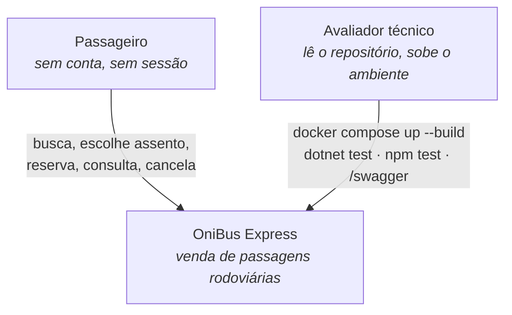
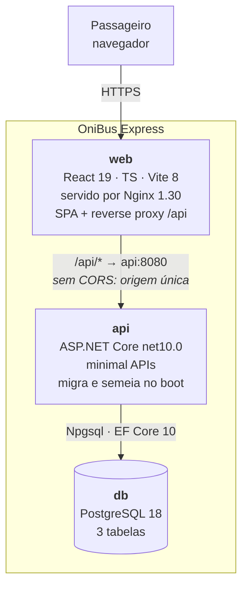
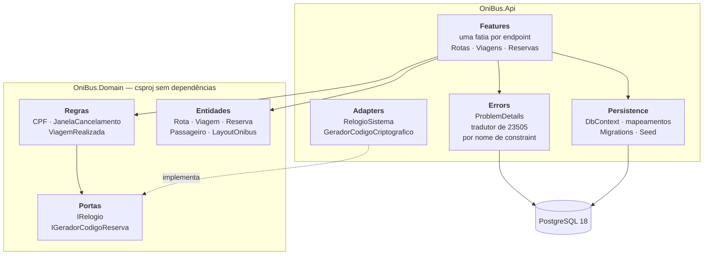
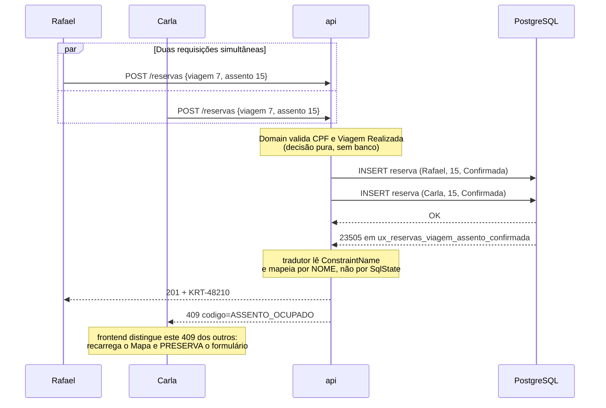
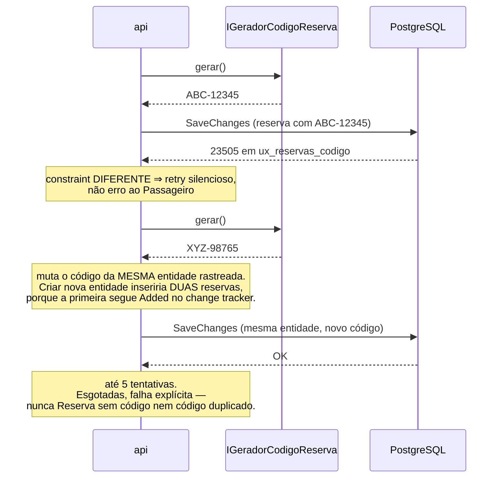
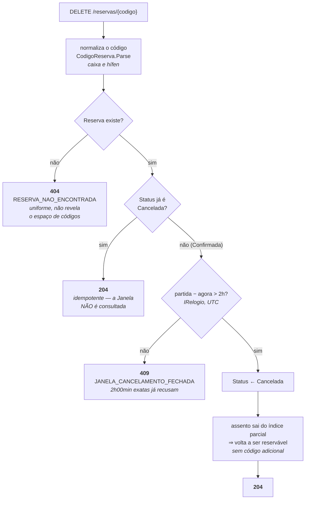
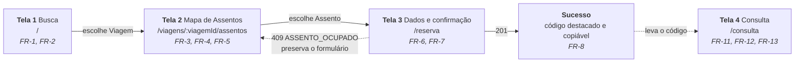
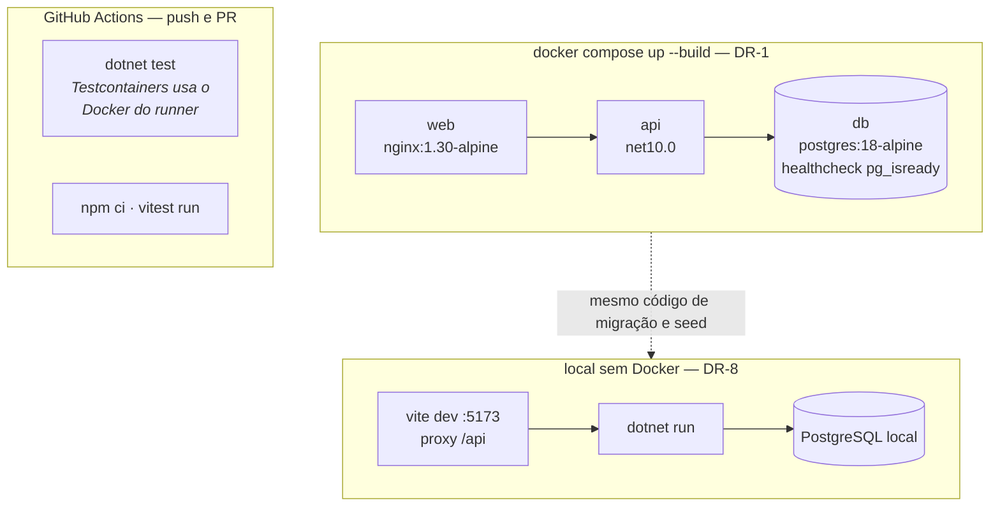

# Diagramas — OniBus Express

Conjunto C4 até nível de componente, mais três diagramas de comportamento para os pontos onde a implementação erra. Os de comportamento são os que valem no README: eles mostram julgamento, e os de estrutura mostram organização.

Os diagramas de estrutura são **seed** — verdadeiros no início, e o código passa a ser o dono deles assim que existir. Os de comportamento carregam invariantes e acompanham os ADs.

---

## C1 — Contexto

Um único ator humano. Nenhum sistema externo: sem gateway de pagamento, sem provedor de e-mail, sem integração com terceiros. A ausência é a informação.

## C2 — Containers

O `web` tem duas responsabilidades de propósito: servir os arquivos estáticos e ser o proxy de `/api`. É isso que faz o frontend nunca conhecer uma URL absoluta de API (AD-11) e que elimina CORS dos dois caminhos de execução.

## C3 — Componentes da `api`

`Domain` não tem seta saindo para nada de infraestrutura — nem para `Persistence`, nem para o banco. Essa ausência é o AD-1, e ela é imposta pelo csproj, não pelo diagrama.

---

## Comportamento 1 — Concorrência no mesmo assento (FR-9)

O diagrama que vale mais no README. Duas requisições simultâneas para o assento 15; exatamente uma reserva confirmada, e a garantia é do banco.

O ponto de julgamento: nenhum `SELECT` de verificação antecede o `INSERT`. Uma verificação em memória passaria em teste sequencial e falharia exatamente aqui.

## Comportamento 2 — Colisão de código de reserva (FR-8)

O mesmo `SqlState 23505` do diagrama anterior, tratamento oposto. É por isso que a discriminação por nome de constraint é invariante (AD-7).

## Comportamento 3 — Cancelamento: precedência entre FR-12 e FR-13

A ordem das verificações é a decisão (AD-17). Invertê-la faz a mesma entrada devolver `204` num builder e `409` no outro.

A janela guarda a **transição** de confirmada para cancelada. Se não há transição a fazer, não há o que impedir — por isso o teste de status vem antes do teste de tempo.

---

## Fluxo do Passageiro e telas

A seta pontilhada de volta é o caso de borda de FR-9 e a razão de existir a store de rascunho (AD-13). `viagemId` está na URL para que F5 no mapa não zere o fluxo.

## Ambientes

Dois ambientes obrigatórios, mais o CI. Nenhum ambiente hospedado — declarado, não esquecido.

O mesmo caminho de código migra e semeia nos dois ambientes. É isso que impede DR-8 de entregar uma busca vazia a quem não usa Docker.
