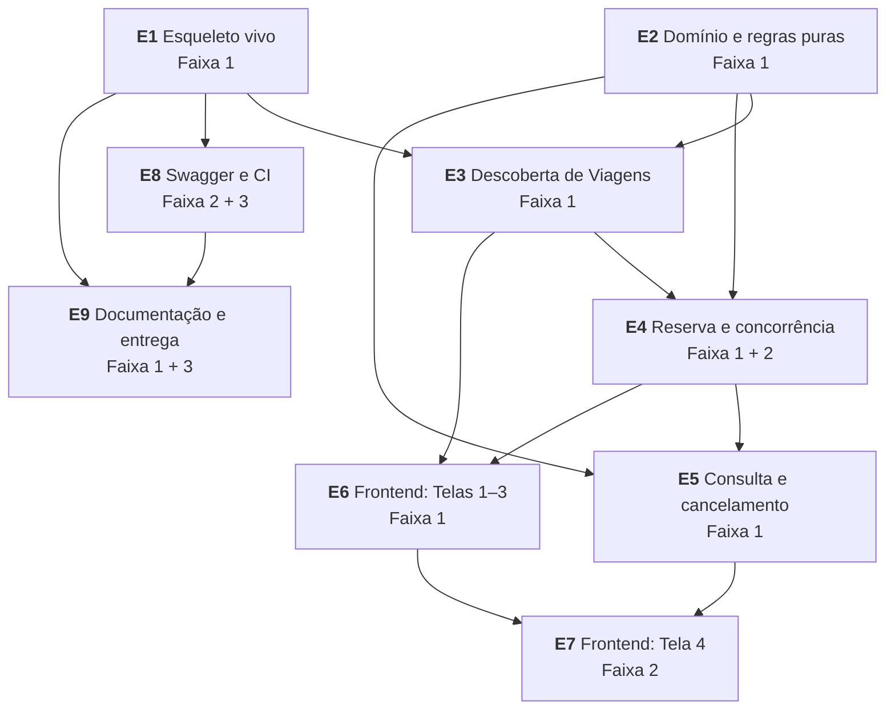

# Divisão do trabalho por épico

Como a arquitetura se corta em épicos e em que ordem construir. Cada épico declara o que entrega, de que ADs depende, e em qual **Faixa de corte** de §10.3 do PRD ele cai — porque a ordem de construção e a ordem de corte não são a mesma coisa, e confundi-las é como se perde uma entrega.

Este arquivo é insumo para `bmad-create-epics-and-stories`, não substituto dele: aqui estão as fronteiras e a sequência, não as histórias.

---

## Duas releituras da ordem de corte que a arquitetura força

Antes dos épicos, dois pontos onde a arquitetura muda como as Faixas devem ser lidas. Ambos merecem sua decisão.

**1. FR-9 não é cortável, e ficou mais barato do que o PRD supôs.** A Faixa 2 lista "FR-9 com garantia de banco e teste de concorrência real" como algo que decide a nota e, implicitamente, como algo que se corta antes da Faixa 1. Com o índice único parcial (AD-6), a **garantia** custa uma linha na primeira migração — ela vem de graça se o schema nascer certo, e é impossível de adicionar depois sem refazer migração. O que custa é o **teste** de concorrência. Logo: o índice vai no épico 1, junto com o schema, e só o teste permanece na Faixa 2. Corte o teste se precisar; nunca o índice.

**2. DR-8 não está em nenhuma Faixa.** O PRD promoveu "rodar sem Docker" a requisito próprio, mas §10.3 distribuiu DR-1, DR-2, DR-4 e DR-7 na Faixa 1 e nunca colocou DR-8 em faixa alguma. Como está, ele não tem prioridade declarada. Tratei-o como **Faixa 2** (é obrigação de README que precisa de fato funcionar, mas não bloqueia a demonstração do produto). Se você discordar, é uma linha a corrigir no PRD.

---

## Grafo de dependências

E1 e E2 são paralelizáveis entre si — E2 não toca infraestrutura por definição (AD-1). Todo o resto tem dependência real.

---

## E1 — Esqueleto vivo, com Docker desde o primeiro dia

**Faixa 1.** Entrega o ambiente inteiro subindo com um comando e um endpoint atravessando as três camadas.

- `git init` e primeiro commit (DR-4 começa aqui, não no fim)
- Solução com os três projetos; `OniBus.Domain.csproj` **sem nenhuma referência** (AD-1)
- `DbContext` e a **primeira migração já com o índice único parcial** `ux_reservas_viagem_assento_confirmada` e com `ux_reservas_codigo` (AD-6). Status persistido como string
- `docker-compose.yml` com os três serviços, healthcheck `pg_isready` e `depends_on: service_healthy` (AD-15)
- `nginx.conf` servindo a SPA e fazendo proxy de `/api` (AD-11)
- Migração e seed no boot, mesmo caminho de código (AD-15)
- `GET /rotas` (FR-1) e uma tela mínima que a consome por caminho relativo

**Governa:** AD-1, AD-6, AD-11, AD-15 · **Entrega:** FR-1, base de DR-1

> Docker no primeiro épico, não no último. É o inverso do instinto e é a decisão mais valiosa da sequência: a partir daqui **todo** commit é verificado no ambiente real que o avaliador vai usar, em vez de num `dotnet run` que funciona só na sua máquina. Docker deixado para o fim é onde entregas de desafio morrem — e DR-1 é critério pontuado.

## E2 — Domínio e as regras puras

**Faixa 1.** O núcleo, sem infraestrutura nenhuma. Paralelizável com E1.

- Entidades: `Rota`, `Viagem`, `Reserva`, `Passageiro` (record, AD-5), `StatusReserva`
- `LayoutOnibus`: 44 assentos, e o **dono único** de `EstadoDosAssentos(reservasConfirmadas)` e da validação 1..44 (AD-4)
- Regras: CPF com sequências repetidas rejeitadas, `JanelaCancelamento`, `ViagemRealizada`
- `CodigoReserva`: formato canônico e `Parse` (dono único da normalização, AD-8)
- Portas `IRelogio` e `IGeradorCodigoReserva` (AD-2)
- `OniBus.Domain.Tests`: **quatro dos cinco testes de regra** — FR-6, FR-8 formato, FR-10, FR-13 nas três fronteiras (2h01 / 2h00 / 1h59)

**Governa:** AD-1, AD-2, AD-3, AD-4, AD-5, AD-8, AD-10, AD-14 · **Entrega:** FR-6, FR-10, FR-13 (regra), 4 dos 5 testes exigidos

> Quatro dos cinco testes de maior peso da entrega fecham aqui, sem banco, sem host e em milissegundos. Só FR-9 sobra para E4, porque a garantia dele é do banco — e essa assimetria *é* o sinal de arquitetura que o desafio procura, não um efeito colateral.

## E3 — Descoberta de Viagens

**Faixa 1.**

- `GET /viagens` com origem, destino e data obrigatórios; tradução da data em intervalo UTC pelo fuso de negócio (AD-3)
- `GET /viagens/{id}` com estado dos 44 assentos, derivado (AD-4)
- Flag de Esgotada; Viagem Realizada omitida da busca
- Seed completo: 5 Rotas, 16 Viagens, datas relativas, incluindo Esgotada, Realizada, parcialmente ocupada, dentro e fora da janela — e passando pelo gerador e pela validação reais (AD-15)
- `ProblemDetails` e o vocabulário de códigos (AD-9)

**Governa:** AD-3, AD-4, AD-9, AD-15 · **Entrega:** FR-2, FR-3, FR-14

## E4 — Reserva e concorrência

**Faixa 1** (a capacidade) **+ Faixa 2** (o teste de concorrência).

- `POST /reservas` com validação servidora independente (AD-14)
- Gerador criptográfico + retry na **mesma entidade rastreada** (AD-7, AD-8)
- Tradutor de `23505` discriminando por nome de constraint (AD-7)
- Recusa de Viagem Realizada (FR-10) usando `IRelogio`
- `OniBus.Api.Tests`: fixture Testcontainers com `postgres:18-alpine`, **teste de concorrência real** (FR-9) e **colisão de código forçada** por gerador de teste (FR-8)

**Governa:** AD-6, AD-7, AD-8, AD-9, AD-10, AD-14 · **Entrega:** FR-7, FR-8, FR-9, FR-10

> O épico que decide a nota. O quinto teste de regra e o único que exige banco real vivem aqui.

## E5 — Consulta e cancelamento

**Faixa 1.**

- `GET /reservas/{codigo}` com normalização na borda, Cancelada retornada normalmente, `404` uniforme
- `DELETE /reservas/{codigo}` na ordem de AD-17: existe? → já Cancelada? → janela
- Verificação de que o assento volta a ficar livre (via FR-3)

**Governa:** AD-8, AD-9, AD-17 · **Entrega:** FR-11, FR-12, FR-13

## E6 — Frontend: Telas 1 a 3

**Faixa 1.**

- Cliente HTTP tipado em `src/shared/api`, normalização de `ProblemDetails`, discriminador de código (AD-12)
- Store Zustand do fluxo, com rascunho do formulário (AD-13); `viagemId` na rota
- Tela 1 busca, com os quatro estados (AD-12); Tela 2 mapa de 44 assentos com estados não dependentes só de cor; Tela 3 formulário, resumo e sucesso com código destacado e copiável
- Tratamento de `409 ASSENTO_OCUPADO`: recarrega o mapa **preservando o formulário**
- Funções únicas de formatação de preço e data (convenção)
- **Os três testes de frontend exigidos**, mockando o cliente tipado (AD-10)

**Governa:** AD-10, AD-11, AD-12, AD-13, AD-14 · **Entrega:** FR-2, FR-4, FR-5, FR-6, FR-7, FR-8 (UI)

## E7 — Frontend: Tela 4

**Faixa 2.** Bônus na especificação, mas sem ela FR-11, FR-12 e FR-13 não têm superfície de interface.

- Campo de código tolerante a caixa e hífen; detalhes da reserva; distinção visual de Confirmada e Cancelada
- Botão de cancelar apenas quando a janela permite; razão explícita na recusa

**Governa:** AD-9, AD-12, AD-17 · **Entrega:** FR-11, FR-12, FR-13 (UI)

## E8 — Swagger e CI

**Faixa 2** (Swagger) **+ Faixa 3** (CI).

- `Microsoft.AspNetCore.OpenApi` + Scalar + redirect de `/swagger` (DR-3)
- GitHub Actions: job backend (`dotnet test`, Testcontainers usa o Docker do runner) e job frontend (`npm ci`, `vitest run`), em push e PR

**Entrega:** DR-3, pipeline de CI

## E9 — Documentação e entrega

**Faixa 1** (DR-2, DR-7) **+ Faixa 2** (DR-8) **+ Faixa 3** (DR-5, DR-6).

- README: rodar com e sem Docker, tecnologias e por quê, decisões de arquitetura, implementado vs. fora, como rodar os testes — partir de `README-ARQUITETURA-RASCUNHO.md`
- **DR-8 verificado de fato**, não só descrito: passos executados numa máquina só com os SDKs
- Screenshots ou gif (DR-5); pontos de melhoria (DR-6), alimentados pela seção *Deferred* da espinha
- Repositório público, clonado em diretório novo e subido com DR-1 sem ajuste (SM-9), e-mail de submissão declarando as partes entregues

**Entrega:** DR-2, DR-5, DR-6, DR-7, DR-8

---

## Sequência sugerida na janela de uma semana

SM-6 exige commits distribuídos em pelo menos três dias distintos, sem nenhum commit contendo mais da metade do código. Isso é uma restrição de **como** trabalhar, não só do que entregar.

| Dia | Foco | Fecha |
| --- | --- | --- |
| 1 | E1 + começo de E2 | ambiente sobe com um comando; schema definitivo |
| 2 | E2 completo + E3 | 4 dos 5 testes de regra passando; busca funcionando via API |
| 3 | E4 | FR-9 provado sob concorrência real — o pico de risco, resolvido no meio e não na véspera |
| 4 | E5 + E8 | API completa e documentada |
| 5 | E6 | Telas 1–3 e os 3 testes de frontend |
| 6 | E7 + CI | Tela 4; pipeline verde |
| 7 | E9 | README, evidência visual, verificação de DR-8, submissão |

Duas propriedades da ordem: **o maior risco técnico é atacado no dia 3**, com folga para reagir, em vez de na última noite; e a partir do dia 1 existe algo demonstrável ponta a ponta, então qualquer corte deixa uma entrega coerente em vez de um meio-caminho.

O ponto de decisão que o PRD antecipou é o **fim do dia 4**: se a API estiver completa e o frontend não tiver começado, é ali que se escolhe entre as duas partes rasas e o backend sólido sem a Tela 4. Com código na mão, não agora.
